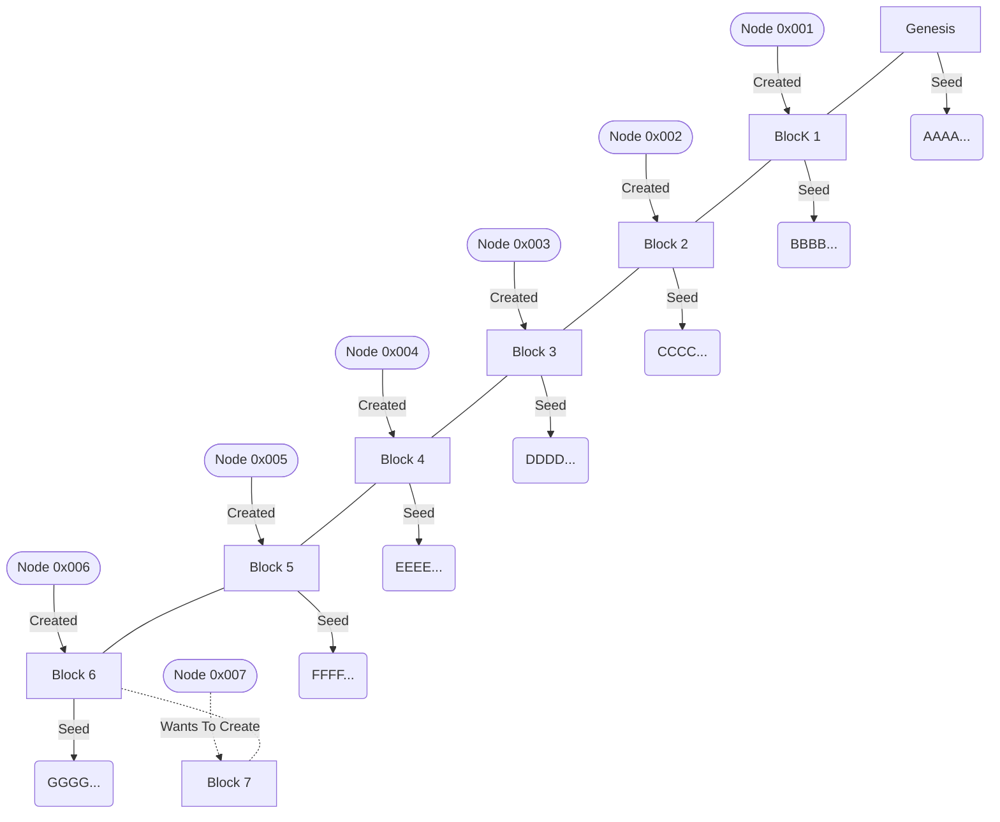
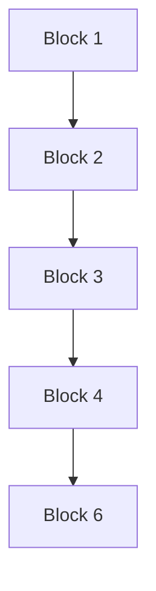

# Funzochain

Funzochain is a blockchain implementation and the proof of concept for our GPoHC Consensus Mechanism or the Generative Proof of History and Co-operation. We have developed GPoHC with a vision to make block creation and validation faster without compromise to decentralisation and security, and to make sure all nodes are equal participants regardless of processing power and other barriers.

---

## Creating a node

To create a node clone this repository and create a file named `run.py`

```python
from node import node
import socket
import rsa

#create an identity (Run Only Once)
with open("identity", "wb") as f:
    f.write(rsa.newkeys(1024)[1])

#load an identity
with open('identity', mode='rb') as f:
    identity = rsa.PrivateKey.load_pkcs1(f.read())


node = node(identity, (socket.gethostname(),80), "node-name")

if __name__ == "__main__":
    node.run()
```

---

## Generative Proof Of History And Co-operation

### Block Structure

```python
{
	“creator”: “0x00000.....”,
	“data”: [...],
	“timestamp”: 1652949456,
	“seed”: “abcdef”,
	“validators”: [...],
	“previous_hash”: “...”
}
```

### Creation Of A New Block

Here is a hypothetical situation where node 0x007 wants to propose a new block to the blockchain.

##### Current Blockchain



##### Network Situation

All Nodes Except 0x005 Are Online.


##### How The Node Proposes A New Block

1. The Node Looks Up The Last `x` Blocks In The Blockchain From The End.

2. If The Creator Of A Block Is Online, It is Added To A List Called `Source Blocks`.
   
   Here:
   


3. Seeds Of All The Blocks In ‘Source Blocks’ Are Joined In Order As A String Called `Source Seed`.
   
   Here: 'AAAABBBBCCCCDDDDFFFFGGGG'.

4. Node 0x007 Now Broadcasts The `Source Seed` To All The Creators Of The Blocks In `Source Blocks`. All The Nodes Will Likely Already Have The Same `Source Seed` And Will Have Encrypted It With Their Private Key As `Seed Root Segment`. If Both The Versions Of `Source Seed` Are Same The Node Will Respond With The `Seed Root Segment`.

5. Node 0x007 Now Takes All Values Of `Seed Root Segment` And Saves As `Seed Root` After Adding Each Character Individually Using:
   
   ```python
   seed_root = []
       for segment in seed_root_segments:
          seed_root.extend([int(y) for y in list("".join(format(ord(x), 'b') for x in str(segment)))])
   ```

6. Node 0x007 Then Passes The Seed Root Array (Lenght 128 Bytes) Through It's GAN's Generator And Stores The Output As `Super Seed`.

7. Node 0x007 Then Encrypts The First 117 Bytes Using It's Private Key And Uses It As The `seed` Attribute For The Block

8. Node 0x007 Now Broadcasts The `Super Seed` To All The Validators Which Then Return A Score After Passing It Through Their GAN's Discriminator. Node 0x007 Then Sums Up All The Score.

9. However, Node 0x003 Has Already Created And Added A Block. Node 0x007 Then Polls All The Active Nodes For 0x003's Last Score, And Finds Out That It Had Gotten More Accumulative Score Than 0x003.

10. After This Node 0x007 Requests An Override On The Last Block (Timeframe Of 5 Seconds For Overriding). More Than 50% Nodes Agree And Update Their Blockchains.

Since Node 0x007 Has Now Become A Creator He Will Become A Validator For For The Next `x` Blocks (Only If Active), And Will Receive Validator Rewards Without Actually Creating A Block.
